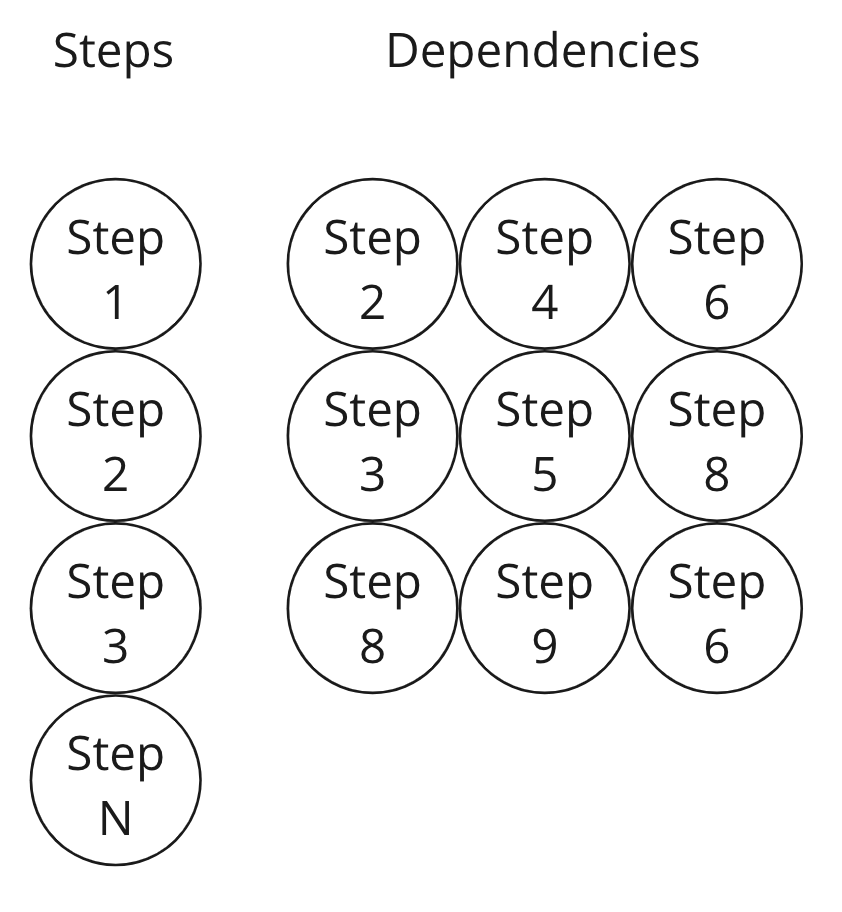
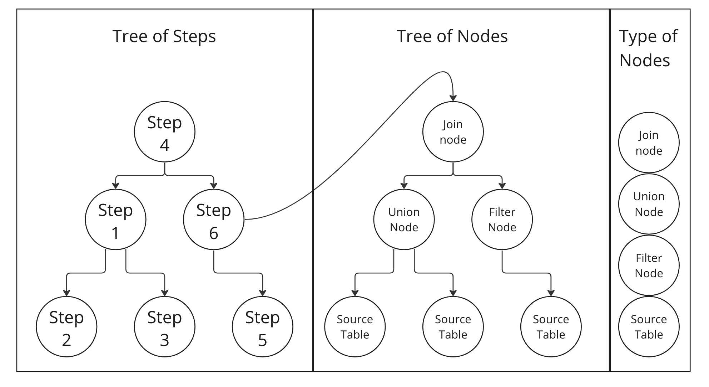

# Генерация тестовых данных
Модуль ГТД.

**Мотивация** Чтобы запустить модуль в пром, необходимо после сборки отбежать обновление на кластере, но во время запусков могут возникнуть проблемы:

* Нет доступов к подпискам


При возникновении таких проблем, модуль нужно будет перезапустить. ГТД дает возможность проводить тестовые запуски локально, помогая сэкономить ресурсы кластера.

ГТД генерирует все необходимые таблицы и данные в них для тестового запуска и позволяет отловить ошибки локально.


## Общая схема работы (user)
1. Юзер дает на вход имя последнего step в модуле
2. ГТД строит граф рассчета, по которому будут генерироваться данные
3. ГТД собирает все ограничения и генерирует данные согласно им для всех таблиц
4. На выходе мы получаем все необходимые таблицы со сгенерированными данными, на которых можно запустить модуль

## Описание структуры данных
**Техническое описание принципов работы ГТД**

Нам необходимо сгенерировать данные для всех таблиц (SourceTableNode), которые будут участвовать в работе модуля. Мы не можем просто сгенерировать рандомные данные, т.к. у существуют виды операций: Join, Uion, ..., Where, который предполагают, что 2 таблицы содержат одинаковые данные по столбцу и т.д.

Чтобы сгенерировать данные согласно этим ограничениям, строится граф из Steps с учетом **dependencies** каждого step. Каждый степ может зависимость от других степов (т.е. для того, чтобы сделать рассчет в степе, нужно посчитать таблицы в других степах). В общем случае степы не идут в последовательности зависимостей, поэтому строится граф с топологической сортировкой с помощью ф-ии ```innerDependenciesLayers```. Т.е. первым будет обрабатываться step, у которого нет зависимостей.

**Общий вид:**

   

Каждый step состоит из своего графа, который уже состоит из sql-операций по типу Join, Union, select и т.д. Нам интересны Join, Union, Select, т.к. при проходе по графу мы будем сохранять ограничения для них и уже в зависимости от ограничений генерировать данные для SourceTableNode.

**Граф вычислений:**
   

1. **Tree of Steps** – наш граф, построенный с учетом топологической сортировки
2. Каждая вершина в этом графе – **Tree of Nodes** – Sql-операции, который делаются над этим степом
3. **Type of Nodes** – типы нод, для которых мы будем собирать ограничения
4. **Source Table** – таблицы, для которых мы будем генерировать данные


## Как работает ГТД
Общая идея: мы строим граф в порядке топологической сортировки (с учетом зависимостей), подвешивая к ...
